# Visual Diagrams for Plan-Act Paradigm Blog

## 1. The Evolution of AI Coding - Effort Distribution

## 2. The Plan-Act Paradigm Flow (Not Modes, But Phases)

## 3. Interrupted Context vs Fresh Start

```mermaid
graph TD
    subgraph "Interrupted Context"
        I1[Initial Task] --> I2[Partial Progress]
        I2 --> I3[❌ Interruption]
        I3 --> I4[Context Confusion]
        I4 --> I5[Degraded Performance]
    end
    
    subgraph "Fresh Start"
        F1[Clear Intent] --> F2[Clean Narrative]
        F2 --> F3[Coherent Execution]
        F3 --> F4[Better Results]
    end
    
    style I3 fill:#ff6666
    style I4 fill:#ff9999
    style I5 fill:#ffcccc
    style F1 fill:#66ff66
    style F2 fill:#99ff99
    style F3 fill:#99ff99
    style F4 fill:#ccffcc
```

## 4. The Anti-Persona Philosophy

## 5. The Slot Machine Principle - Parallel Futures

## 6. Safety Through Timing

## 7. Evolution of Intent Sharing

## 8. The Human-AI Collaboration Loop

---

These diagrams can be embedded directly in the blog post or used in presentations about the Plan-Act paradigm. Each visual reinforces a key concept from the written content.
